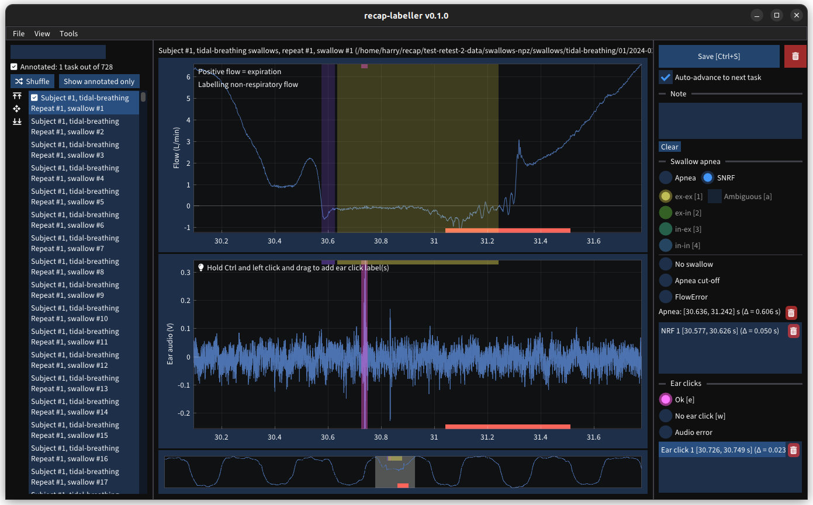

# RECAP swallow labeller

**Note:** this branch is for a version of the labeller that supports labelling
multiple swallow events in a single recording file. For the original version,
which only allows labelling a single swallow per recording, see `main` branch.



Application for labelling swallows built with
[Dear ImGui](https://github.com/ocornut/imgui) and
[implot](https://github.com/epezent/implot).

## Building

Requires `cmake` and the `vcpkg` submodule to be cloned.

### Linux

To install dependencies on Ubuntu/Debian:

```
apt-get install libdbus-1-dev libglfw3-dev libgtk-4-dev libopengl-dev
```

(Other dependencies should be installed via vcpkg and FetchContent.)

```
cmake -B build --toolchain vcpkg/scripts/buildsystems/vcpkg.cmake -DCMAKE_BUILD_TYPE=Release .
cmake --build build --parallel
```

(Alternatively, for development, use the `linux-gcc-ninja-multi-dev` preset. See
[Development build settings](#development-build-settings) below.)

### Windows (MSVC)

```
cmake --preset <preset> [-DCMAKE_BUILD_TYPE=<build type>]
cmake --build build [--config <build type>] --parallel
```

Where `<preset>` is one of the presets listed in `CMakePresets.json`:

* `windows-static` (default *multi-config* Visual Studio build generator, run
  `cmake -G` to see the default)
* `windows-static-ninja` (Ninja *single-config* build generator)
* `windows-static-ninja-multi` (Ninja *multi-config* build generator)
* `windows-static-ninja-multi-dev` (Ninja *multi-config* build generator with
  some additional settings enabled for development)

The `<build-type>` can be `Release`, `Debug`, `RelWithDebInfo`, etc. When using
a single-config generator, you need to specify the build type at configure time
(via the `-DCMAKE_BUILD_TYPE` flag in the first command). When using a
multi-config generator, you need to specify the build type in the build command
(`--config` flag, second line).

I recommend using one of the Ninja generators for local development on Windows,
as Ninja can *significantly* decrease build times on multi-core machines and
when running incremental builds.

A range of build presets have been provided for if you are using VS Code with
the CMake Tools extension and a multi-config generator. For a single-config
generator, you can just change the `CMAKE_BUILD_TYPE` cache variable in VS Code
or add the `-DCMAKE_BUILD_TYPE=` flag to the `cmake.configureArgs` property
in your workspace `settings.json`.

### Development build settings

The GUI will run at a very low frame rate if built in `Debug` mode, so I
recommend building in `RelWithDebInfo` for development. This will disable Dear
ImGui's assertions (`IM_ASSERT`), which by default use the stdlib `assert`
function that is disabled in non-debug builds. To re-enable `IM_ASSERT` under
non-debug builds:

```
cmake -DIMGUI_ALWAYS_ASSERT=on build
```

(or pass `-DIMGUI_ALWAYS_ASSERT=on` during configuration.)

I recommend enabling these ImGui assertions during development as they can help
you spot invalid ImGui usage such as mismatched window `Begin()/End()` calls and
don't slow down the GUI that much. The `IMGUI_DEBUG_WINDOW_BEGIN_ONCE` will
cause ImGui to validate that window `Begin()/End()` calls are matched the first
time they are made. ImGui can be configured to validate this every frame by
enabling
`Tools > ImGui Metrics/Debugger > Tools > Debug Begin/BeginChild return value`
in the GUI, but this will cause the application to flicker.

Some basic debug metrics (frame rate, mouse position, etc.) can be displayed on
the bottom status by of the GUI by toggling `Tools > Show debug info` in the
GUI. This can be enabled by default by setting the `DEFAULT_SHOW_DEBUG_INFO`
option in CMake.

Sanitizers can be enabled for the GUI via the `ENABLE_LABELLER_SANITIZERS`
CMake option (will reduce frame rate and make compilation MUCH slower).
Can be enabled just for tests via `ENABLE_TEST_SANITIZERS`.

A configure preset is provided for Linux development with GCC using the Ninja
multi-config generator. It enables all the above options by default except for
`ENABLE_LABELLER_SANITIZERS`. To use:

```
cmake --preset linux-gcc-ninja-multi-dev
```

If the frame rate is too low, try reducing the number of plot points, either by
setting `max_num_plot_points` in the config JSON file (and passing path to the
config file via `--config` CLI command), or setting
`RECAP_LABELLER_MAX_NUM_PLOT_POINTS` env var when running app.

### Linting and formatting

There are three build targets for formatting and linting the code:

* `lint`: check formatting with `clang-format`
* `format`: format code automatically with `clang-format`
* `check`: check code with `cppcheck`

The `cppcheck` and `clang-format` executable are automatically installed from
their PyPI packages using [uv](https://docs.astral.sh/uv/), which must be
installed. To disable these targets, set `ENABLE_LINTING=off` at configure time.

### Testing

Requires Python and [uv](https://docs.astral.sh/uv/) to generate test data.

Sanitizers can be enabled by setting `ENABLE_TEST_SANITIZERS=on` during
configuration.

After building the project, run `ctest` in the build directory to run tests.

### Demo

The GUI can be run with some randomly-generated demo data by running the
`run-demo` build target.

```
cmake --build build --target run-demo
```

This requires Python and [uv](https://docs.astral.sh/uv/) to generate demo data.
